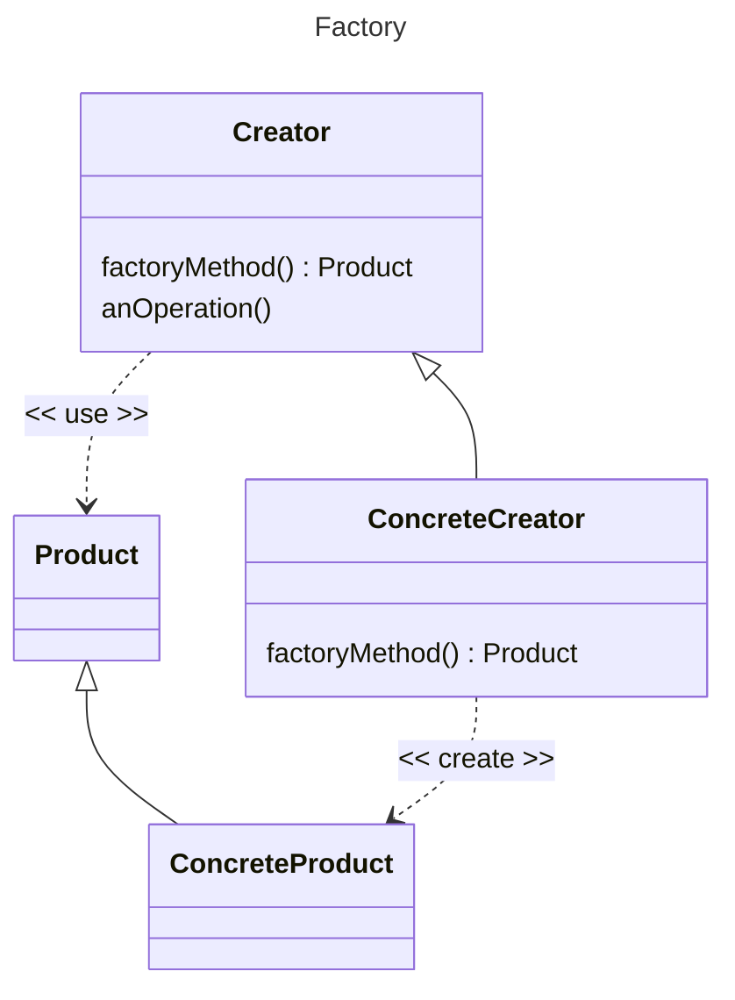

[DesignPatternsPHP
](https://github.com/DesignPatternsPHP/DesignPatternsPHP)

## Factory

El patron Factory es creacional, se utiliza para ayudar a la creación de nuevas instancias de objetos, es decir plantea simplificar una instancia. Es una clase que se puede reutilizar de forma polimorfica.

Se utiliza cuando la creación del objeto es un proceso complejo.





```php
class Automobile{
    private $vehicleMake;
    private $vehicleModel;

    public function __Construct($make,$model){
        $this->vehicleMake=$make;
        $this->vehicleModel=$model;
    }

    public function getMakeAndModel(){
        return $this->vehicleMake.' '.$this->vehicleModel;
    }
}

class AutomobileFactory {
    private static $model;

    public static function create($make) {
        self::$model = date('Y');
        # regresa un objeto tipo Automobile
        return new Automobile($make, self::$model);
    }
}

$renault = new Automobile("Renault", 2019);
$toyota = AutomobileFactory::create("Toyota");

echo $renault->getMakeAndModel().PHP_EOL;
echo $toyota->getMakeAndModel().PHP_EOL;
```


```javascript
interface EnemyFactory{
    createEnemy():Entity
}
interface Entity{
    updateLogic():void;
}

class GoombaFactory implements EnemyFactory{
    createEnemy():Entity{       //returns only goombas
    }
}
class RandomEnemyFactory implements EnemyFactory{
    createEnemy():Entity{       //returns enemies randomly
    }
}
class RandomDifficultEnemyFactory implements EnemyFactory{
    createEnemy():Entity{       //returns only difficult enemies
    }
}

class Boo implements Entity{

}
class Koopa implements Entity{
    
}
class Goomba implements Entity{
    
}

```
